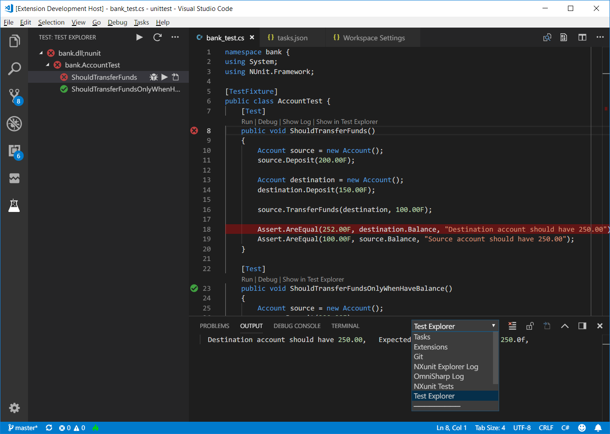

# NXunit Test Explorer for Visual Studio Code

Run your Nunit or Xunit test for Desktop .NET Framework or Mono using the 
[Test Explorer UI](https://marketplace.visualstudio.com/items?itemName=hbenl.vscode-test-explorer).

## Features

* Shows a Test Explorer in the Test view in VS Code's sidebar with all detected tests and suites and their state
* Adds CodeLenses to your test files for starting and debugging tests
* Adds Gutter decorations to your test files showing the tests' state
* Adds line decorations to the source line where a test failed
* Shows a failed test's log when the test is selected in the explorer
* Lets you choose test suites that should be run automatically after each assembly change

## Getting started

* Install the extension and restart VS Code
* Set test console runner path (see Configuration options table below).
* Open the Test view
* Run / [Debug](https://github.com/OmniSharp/omnisharp-vscode/wiki/Desktop-.NET-Framework) ([mono](https://github.com/Microsoft/vscode-mono-debug)) your tests using the  /  icons in the Test Explorer or the CodeLenses in your test file

## Configuration

### Options

Property                        | Description
--------------------------------|---------------------------------------------------------------
`nxunitExplorer.modules`  		| The glob describing the location of your test assemblies (relative to the workspace folder) (default: `"**/bin/**/*.{dll,exe}"`)
`nxunitExplorer.nunit`    		| The path to the nunit console runner. If this option is not set then extention will search packages/NunitConsoleRunner*/tools/nunit3-console.exe (relative to the workspace folder).
`nxunitExplorer.xunit`    		| The path to the xunit console runner. If this option is not set then extention will search packages/xunit.runner.console*/tools/xunit.console.exe (relative to the workspace folder).
`nxunitExplorer.monoruntime`	| The path to the Mono binary
`nxunitExplorer.usemono`		| use Mono instead of Desktop .Net (default `false` for Windows). This option is always `true` for other platforms
`nxunitExplorer.skippattern`	| Assemblies to skip from searching for tests.(default: exclude any files starting with nunit.\*.dll or xunit.\*.dll)

## Troubleshooting
If the Test view doesn't show your tests or anything else doesn't work as expected, you can check any error messages from the runner in `NXunit Test` output channel. Also you can turn on diagnostic logging using  the following configuration options
(note: in multi-root workspaces, these options are always taken from the first workspace folder):
* `nxunitExplorer.logpanel`: Write diagnotic logs to an output panel

If you think you've found a bug, please [file a bug report](https://github.com/prash-wghats/vscode-nxunit-test-adapter/issues).
